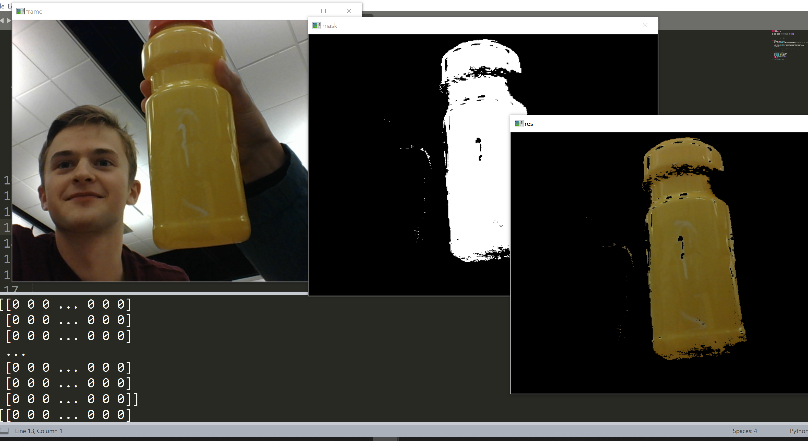

# Color-Object-Detection

Colored Object detection using OpenCV. First CV program which detects orange objects. Orange apple was used for the demo.
Starter code for color was obtained from OpenCV documentation and modified to detect orange objects.

